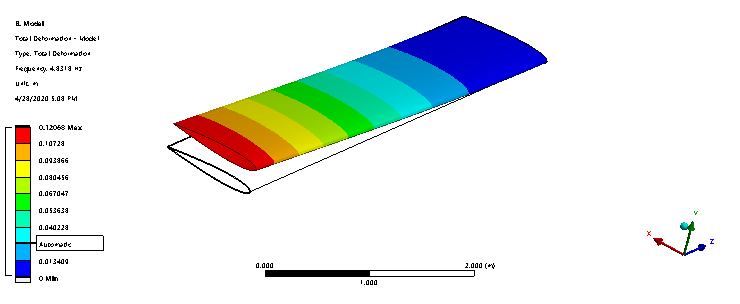

# Wing Modal Analysis 
In this project, you'll find the full project details of a modal analysis of a typical aircraft wing.

## Built With

* [WorkBench 2020 R1](https://www.ansys.com/products/platform) - CAE simulation framework used
* [Ansys Mechanical APDL Solver](https://www.ansys.com/services/training-center/structures/introduction-to-ansys-mechanical-apdl) - Modal analysis solving method

## License

This project is licensed under the MIT License - see the [LICENSE.md](LICENSE.md) file for details
